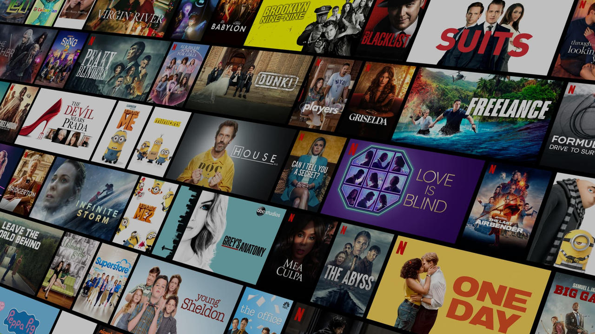

# Netflix Clone 🎬

This is a simple clone of the Netflix landing page built using **HTML** and **CSS** only. It's a static replica and responsive design of Netflix's homepage to practice front-end development skills.

## 🔥 Features

- Responsive layout for different screen sizes
- Custom Netflix-style homepage
- CSS-only hover effects and layout
- Email input and "Get Started" button layout
- FAQ section
- Footer with useful links

## 📁 Project Structure

## 🛠️ Tech Stack

- HTML5
- CSS3
- Fonts from Google Fonts
- Custom Netflix-themed layout

## 🌐 Live Demo

> Coming Soon (Deploy on GitHub Pages or Netlify!)

## 📸 Screenshots

 <!-- Optional: Add screenshot of your project -->

## 🙌 Author

- **Hasibur Rahaman**  
[LinkedIn](https://www.linkedin.com/in/hasibur-rahaman-108b24228) | [GitHub](https://github.com/Hasibur-123)

## 📌 Note

This project is for learning purposes only and is not affiliated with Netflix.
